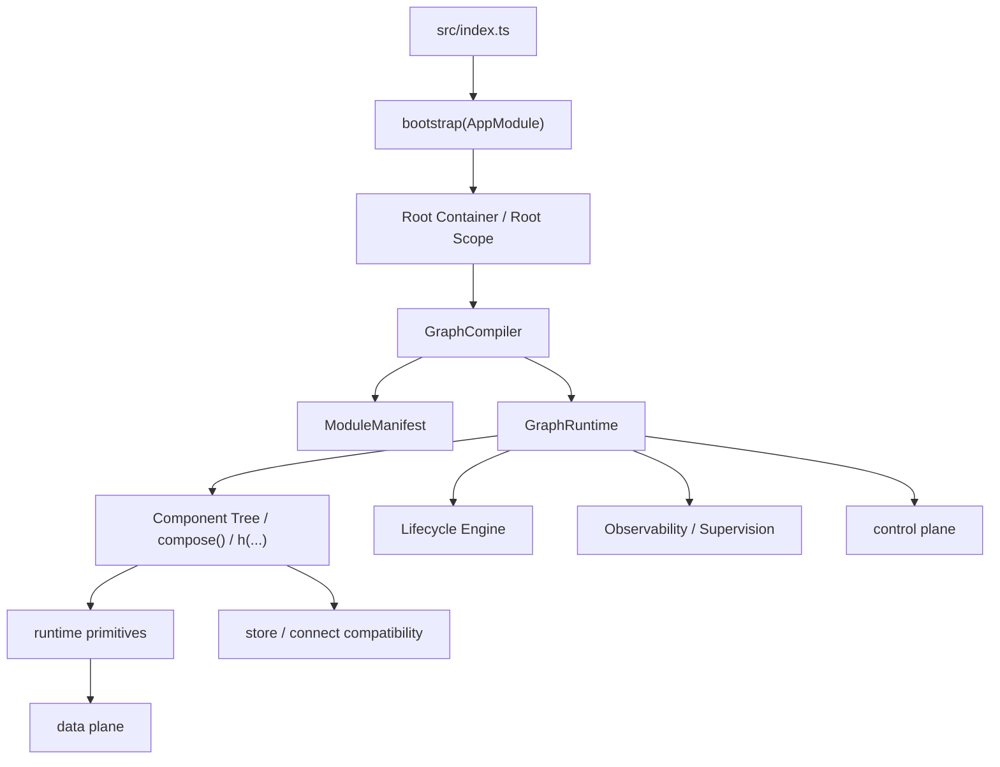

# Effectable: architectural concept

> **Archived / historical.** This draft mixes the current library with unimplemented roadmap items (`ModuleManifest`, `GraphCompiler`, host-app migration). Canonical architecture for the published package: [../ARCHITECTURE.md](../ARCHITECTURE.md).

## Document metadata

| Field | Value |
| --- | --- |
| Title | `Effectable` as a declarative runtime framework for backend systems |
| Version | `0.1` |
| Status | `archived` |
| Audience | Historical reference only |
| Related documents | `README.md`, `docs/ARCHITECTURE.md`, `src/**` |

## 1. Summary

*Short version of the document for a 2–3 minute read.*

### What is proposed

The proposal is to evolve `Effectable` as a declarative runtime framework for backend systems that combines:

1. Declarative composition via `compose()` and `h(...)`;
2. scoped DI and contexts instead of manual global wiring;
3. lifecycle management for long-lived runtime components;
4. automatic registration of domains and modules via self-describing `ModuleManifest`;
5. graph-based orchestration instead of manual assembly in `src/index.ts`;
6. compatibility with low-latency/high-throughput scenarios, including algo-trading.

At the same time, `Effectable` should be perceived as a single platform with a convenient, stable entry point `effectable`, not as a set of loosely related subpackages.

### Why it is needed

The new approach is needed to remove several practical problems at once:

1. remove manual wiring of domains and infrastructure from top-level bootstrap code;
2. make domains self-describing and suitable for automatic registration;
3. get an explicit runtime graph of dependencies, lifecycle, and orchestration;
4. separate `control plane` and `data plane` so orchestration does not break the fast path;
5. formalize lifecycle, failure semantics, and cleanup rules;
6. keep existing low-level runtime primitives as substrate, but raise a stronger system composition model above them.

### Main invariant

`NEW` must improve composition and system manageability without degrading the fast path.

### What we deliberately do not do

The concept deliberately must not:

1. hide the critical trading path behind heavy reconciliation or runtime reflection;
2. turn every dependency into a global singleton;
3. make implicit magic more important than explicit architectural contracts;
4. replace domain modeling with a set of decorators without a strict lifecycle model;
5. require a full rewrite of the whole system before first results;
6. turn `Effectable/runtime` into a dumping ground for unrelated entities.

## 2. Context

### Problem

The current ecosystem around `Effectable` and the application experiences several systemic problems.

1. The top application entry point is overloaded with manual wiring. In `src/index.ts`, runtime primitives, domain objects, connectors, and infrastructure adapters are created and linked by hand.
2. Domains are not yet self-describing modules. Starting them and managing lifecycle requires external imperative code.
3. `Component`, `connect`, and runtime primitives exist as useful but fragmented building blocks; there is no coherent graph/runtime model.
4. Current component lifecycle is too weak and does not separate internal runtime stages, mounted semantics, and standalone mode.
5. `connect` is a class-based HOC: it returns a subclass of the original component, overrides `onMount`/`onUnmount`, and delegates to `super`; on the first store emit it merges mapped values into `props` before `super.onMount`, later emits go through `setState({})` → `onUpdate`.
6. `Effectable/runtime` risks growing into a general warehouse of any runtime ideas, though it should remain a thin low-level layer.
7. The system must be suitable for algo-trading and high load, so orchestration must not accidentally land on the hot trading path.

### Constraints and assumptions

The decision is made within these bounds:

1. Application registration must happen in `src/index.ts`.
2. The first root component mounted through the new runtime must be `src/app.ts`.
3. The transition must be incremental: a full rewrite of the whole system is not required and is not allowed as a mandatory condition.
4. In the first stage only some domain areas become reactive components; the rest of the infrastructure may remain imperative.
5. `Component` must remain a low-overhead primitive for long-lived runtime objects.
6. `EventBus`, `CommandBus`, `QueryBus`, and `HandleRegistry` are not discarded: they remain the substrate layer.
7. `connect` may live as a compatibility layer for as long as migration requires.
8. In mounted mode lifecycle must be strictly defined; in standalone mode `Component` keeps weaker semantics.
9. For the first migration waves, domains are moved as domain molecules, not as idealized new bounded contexts.

### Why the current approach is not enough

The current model is insufficient for several reasons:

1. it does not provide painless auto-registration of domains;
2. it does not describe the runtime graph as a first-class abstraction;
3. it does not formalize lifecycle, failure path, and cleanup semantics;
4. it does not define a strict boundary between `standalone` and `mounted runtime` use of `Component`;
5. it does not solve the growth of `runtime/`;
6. it does not provide a single public entry point and a durable extension model via manifests, providers, and plugins.

## 3. Goals and boundaries

### Goals

In the target model, `Effectable` should solve the following tasks:

1. allow domains to register automatically via self-describing manifests;
2. make links between modules visible as a runtime graph;
3. manage node and domain subgraph lifecycle centrally;
4. support scoped dependencies: `app`, `domain`, `session`, `transient`;
5. allow flexible environment swapping: `live`, `sim`, `backtest`, `dev`;
6. provide strong observability for operations and debugging;
7. separate `control plane` and `data plane` so orchestration does not break the low-latency hot path;
8. provide a single convenient public API through `effectable`;
9. keep low-level runtime primitives as foundation, but raise a graph/runtime model above them;
10. enable a realistic transition from the current implementation to the new concept without rewriting the whole application.

### Non-goals

The following are out of scope:

1. a full one-shot move of all services, adapters, and leaf-level classes into the new declarative model;
2. mandatory immediate replacement of all current connectors, store wiring, and imperative bootstrap fragments;
3. introducing distributed mode as a mandatory first step;
4. fully abandoning the current `CommandBus`, `QueryBus`, `EventBus`, `HandleRegistry`;
5. building a “magical” runtime that hides every architectural decision from the developer.

### In scope / out of scope

| In scope | Out of scope |
| --- | --- |
| Public API `effectable` | Full application rewrite |
| `bootstrap`, root container, root component | Immediate full replacement of all external infrastructure |
| `Component`, lifecycle, `compose()`, `h(...)`, refs, contexts | Moving every leaf-level class into the declarative model |
| `ModuleManifest`, graph compilation, lifecycle engine | Immediate distributed implementation |
| Separation of `control plane` and `data plane` | Fully abandoning legacy compatibility layers |
| Incremental migration via domain molecules | Turning all internal runtime stages into public hooks |

## 4. Terms

| Term | Definition | Where used |
| --- | --- | --- |
| `Component` | Base low-level primitive with `state`, `props`, and a local lifecycle API | `Effectable/component` |
| `standalone mode` | Mode where `Component` is used as a stateful object without graph runtime and component tree | `Component`, `setState`, `onUpdate` |
| `mounted runtime mode` | Mode where the component is managed by the runtime tree and follows a strict lifecycle state machine | `bootstrap`, `GraphRuntime`, lifecycle engine |
| `ModuleManifest` | Self-describing module/domain contract describing dependencies, capabilities, lifecycle policy, and compose logic | `graph/`, auto-registration |
| `bootstrap` | Startup mechanism that turns a static class tree into a living reactive system | `bootstrap/`, `src/index.ts` |
| `root component` | First component from which runtime graph materialization starts | `src/app.ts` |
| `domain molecule` | Reactive shell around an existing important domain process or service | incremental migration |
| `GraphCompiler` | Subsystem that collects manifests, validates the graph, and builds a compiled execution plan | `graph/` |
| `GraphRuntime` | Runtime engine for materialization, reconcile, lifecycle, and orchestrated execution | `graph/`, `component/` |
| `control plane` | Composition, DI, lifecycle, validation, plugin registration, and observability layer | orchestration |
| `data plane` | Latency-sensitive execution layer: market data, order routing, risk pre-check, strategy execution | fast path |
| `compatibility layer` | Temporary compatibility layer with the old approach, e.g. `connect` or legacy hooks | `connect/`, `component/` |
| `runtime primitive` | Low-level entity such as `EventBus`, `CommandBus`, `QueryBus`, `HandleRegistry` | `runtime/` |

## 5. Target model

### Overall scheme

In the target model, `Effectable` consists of several related layers:

1. `src/index.ts` as the explicit top-level application start point;
2. `bootstrap` as the root runtime start mechanism;
3. root container and scoped DI;
4. `ModuleManifest` and `GraphCompiler` as the modular composition layer;
5. `GraphRuntime` and the `component` layer as the materialization and lifecycle mechanism;
6. low-level runtime primitives as substrate;
7. `store` and `connect` as separate compatible layers;
8. observability, supervision, and plugin system as systemic runtime capabilities.



### Main system parts

| Part | Role | Main interface or entry point |
| --- | --- | --- |
| `effectable` | Single public entrypoint | `Effectable/index.ts` |
| `bootstrap/` | Application start, root container, base infrastructure tokens | `bootstrap(...)` |
| `component/` | `Component`, lifecycle, `compose()`, `h(...)`, reconciliation, context/ref, tree-bound behavior | `Component`, `compose()`, `h(...)` |
| `graph/` | `ModuleManifest`, graph compilation, provider graph, runtime orchestration | `ModuleManifest`, `GraphCompiler`, `GraphRuntime` |
| `runtime/` | Thin layer of low-level runtime primitives and compatibility mechanisms | `EventBus`, `CommandBus`, `QueryBus`, `HandleRegistry` |
| `store/` | Reactive store and selector/middleware mechanisms | `createStore`, `select`, middleware |
| `connect/` | Compatibility layer for the current store-driven connect approach | `connect(...)` |

### Data or control flow

Main control scenario in the target model:

1. `src/index.ts` starts the application via `bootstrap(AppModule)`;
2. `bootstrap` creates the root DI/container scope;
3. runtime registers `EventBus`, `CommandBus`, `HandleRegistry`, and compatible infrastructure providers in the root scope;
4. the root component materializes and calls the first `compose()`;
5. the tree of `h(...)` nodes is materialized recursively;
6. context scope is passed to children; `ContextProvider` extends subtrees;
7. refs are bound via `ref.current`;
8. lifecycle brings nodes to `ready`;
9. later props/state/context changes trigger reconcile and update-pass;
10. when a node disappears, runtime goes through `onUnmount()` and moves the node to `destroyed`;
11. on error, runtime uses the failure path and supervision policies;
12. when needed, runtime interacts with `store`, `connect`, and low-level runtime primitives as compatible layers.

### Cross-cutting rules

1. `compose()` describes topology; lifecycle hooks perform side effects.
2. `Component` as a base class remains a low-level primitive.
3. `onUpdate` in the base `Component` is always allowed after `setState()` in standalone mode.
4. `connect` and the future graph runtime must follow stricter mounted semantics.
5. In mounted mode, `onUpdate` must not be called before a successful `onMount`.
6. The first mounted pass (merge mapped props in the connect HOC) runs before `super.onMount`; later emits are translated via `setState({})` → `onUpdate`.
7. `effectable` must be the canonical public entrypoint.
8. `Effectable/runtime` must remain a thin low-level layer.
9. `control plane` and `data plane` must be separated.
10. The new orchestration runtime must not degrade the fast path.

## 6. Key decisions

### Public API and library structure

**Purpose.**

Make `Effectable` a single platform with a convenient, stable entry point `effectable`, and strictly define subfolder structure and responsibility boundaries.

**Rules and contract.**

The base path of the shared library is `Effectable`.

The main developer-facing API should be easy to import from:

```typescript
import {
  Component,
  h,
  bootstrap,
  UseRef,
  UseImperativeHandle,
  UseContext,
  UseEventBus,
  UseCommandBus,
  OnEvent,
  OnCommand,
} from 'effectable';
```

Public API rules:

1. all stable userland primitives are exported from `Effectable/index.ts`;
2. imports from child paths are allowed only for special cases, advanced usage, or internal infrastructure;
3. user code should not need to remember which deep subfolder holds a base decorator, lifecycle primitive, or bootstrap helper;
4. `effectable` is the main contract entrypoint;
5. internal implementation details are not automatically part of the public API just because they live in the repository.

Subfolder structure rules:

1. everything related to `Component`, lifecycle, reconciliation, `compose()`, `h(...)`, `ref`, component tree, and tree-bound error boundaries lives in `Effectable/component`;
2. everything related to modular composition, manifests, graph compilation, and bootstrap lives in a dedicated specialized subfolder, not dissolved into `runtime`;
3. `Effectable/runtime` remains a thin layer for truly low-level runtime primitives or temporary compatibility API;
4. excess content from `Effectable/runtime` should be moved out or removed.

In the long-term model:

1. `Effectable/index.ts` becomes the canonical public entrypoint;
2. `Effectable/component/` becomes the main home for component/lifecycle mechanics;
3. `Effectable/runtime/` shrinks to a minimal, meaningful set of low-level primitives;
4. large new subsystems appear as separate subfolders, not as new files in `runtime/`.

Target library file structure:

```text
Effectable/
├── index.ts
├── README.md
├── CONCEPT.md
├── bootstrap/
│   ├── index.ts
│   ├── bootstrap.ts
│   ├── RootContainer.ts
│   ├── tokens.ts
│   └── types.ts
├── component/
│   ├── index.ts
│   ├── Component.ts
│   ├── lifecycle.ts
│   ├── h.ts
│   ├── reconcile.ts
│   ├── context.ts
│   ├── refs.ts
│   ├── decorators.ts
│   ├── errorBoundary.ts
│   ├── types.ts
│   └── README.md
├── graph/
│   ├── index.ts
│   ├── ModuleManifest.ts
│   ├── GraphCompiler.ts
│   ├── GraphRuntime.ts
│   ├── ProviderRegistry.ts
│   ├── scopes.ts
│   ├── diagnostics.ts
│   └── types.ts
├── runtime/
│   ├── index.ts
│   ├── EventBus.ts
│   ├── CommandBus.ts
│   ├── QueryBus.ts
│   ├── HandleRegistry.ts
│   └── types.ts
├── store/
│   ├── index.ts
│   ├── createStore.ts
│   ├── selector.ts
│   ├── middleware.ts
│   ├── semanticStateTree.ts
│   ├── types.ts
│   └── README.md
└── connect/
    ├── index.ts
    ├── connect.ts
    ├── types.ts
    └── README.md
```

Purpose of target subfolders:

1. `bootstrap/` — top-level application start, root container, base infrastructure tokens;
2. `component/` — `Component`, lifecycle, `compose()`, `h(...)`, reconciliation, context/ref, and tree-bound behavior;
3. `graph/` — manifests, provider graph, graph compilation, module resolution, and runtime orchestration;
4. `runtime/` — minimal set of low-level runtime primitives and compatibility mechanisms;
5. `store/` — reactive store and related selector/middleware mechanisms;
6. `connect/` — compatibility layer for the current store-driven connect approach.

Final structure rule:

1. if a new entity describes tree lifecycle or component behavior, it goes into `component/`;
2. if it describes graph/module/bootstrap semantics, it goes into `bootstrap/` or `graph/`;
3. if it is only a low-level primitive for events, commands, queries, or handles, it may live in `runtime/`;
4. if an entity is not a low-level primitive, it must not be added to `runtime/` by default.

**Constraints and trade-offs.**

1. the library structure becomes more granular and requires discipline in maintaining the public API;
2. the transition cannot be one-shot; some old files and subfolders will live as a compatibility layer;
3. some entities are not implemented yet and exist only as the target model.

**Related decisions.**

`Component` as a low-latency primitive, `bootstrap`, `ModuleManifest`, `GraphCompiler`, role of current runtime primitives.

### `Component` as a low-latency primitive

**Purpose.**

Keep `Component` a very light and very fast base entity around which an orchestration runtime can be built, without making it the thickest container itself.

**Rules and contract.**

`Component` from `Effectable/component/Component.ts` must remain a low-overhead primitive for long-lived runtime objects.

Performance requirements:

1. base component operations have predictable cost;
2. `setState()` and local lifecycle transitions must not pull in reflection, global scans, or heavy DI logic;
3. the hot path must not rely on deep copies, global registrations, or expensive magic;
4. critical sections must work through direct refs, pre-resolved handles, and compiled graph metadata;
5. reconciliation and orchestration are allowed only where they do not break low-latency requirements;
6. `Component` must remain suitable for ultra-fast scenarios, including trading runtime and high-throughput backend processes.

Architectural rule:

If a new capability makes `Component` heavier, more complex, and less predictable on the hot path, it must live in the wrapping around the component, not inside the base primitive.

Two modes of using `Component`:

1. `standalone mode`
2. `mounted runtime mode`

`standalone mode`:

1. `Component` is used as a light stateful object without a component tree and without graph runtime;
2. `setState()` may be called directly by the consumer;
3. `onUpdate()` may be called without `mounted/ready` stages;
4. there are no mandatory `onMount/onUnmount` stages;
5. `Component` works as a low-level primitive: state + props + local reaction to changes.

`mounted runtime mode`:

1. the component is managed by the runtime tree and follows the full lifecycle state machine;
2. runtime controls materialization;
3. runtime guarantees lifecycle hook order;
4. `onUpdate()` becomes part of tree-managed update semantics;
5. `onMount/onUnmount` get a meaningful role only in this mode.

Key rule for reconciling modes:

1. in mounted runtime mode, `onUpdate()` must not be called before a successful `onMount()`;
2. in standalone mode, weaker semantics are allowed: `onUpdate()` may be called on any `setState()` after instance creation, even if the node was never part of a tree;
3. documentation must explicitly distinguish `tree-managed lifecycle hooks` and `low-level state callbacks`.

**Example (dedicated case).**

Case: a standalone component keeps a compact buffer of recent ticks and does not depend on graph runtime on the hot path.

```typescript
type Tick = {
  price: number;
  ts: number;
};

class TickBuffer extends Component<{ size: number }, { symbol: string }> {
  private readonly limit: number = 64;
  private readonly ticks: Tick[] = [];

  constructor(props: { symbol: string }) {
    super(props);
    this.state = {
      size: 0,
    };
  }

  public pushTick(tick: Tick): void {
    this.ticks.push(tick);

    if (this.ticks.length > this.limit) {
      this.ticks.shift();
    }

    this.setState({ size: this.ticks.length });
  }

  onUpdate(_prev: { size: number }, next: { size: number }): void {
    metrics.gauge('tick_buffer_size', next.size, {
      symbol: this.props.symbol,
    });
  }
}

const buffer = new TickBuffer({ symbol: 'BTCUSDT' });

buffer.pushTick({ price: 104250, ts: Date.now() });
```

**Constraints and trade-offs.**

1. two different behavior semantics must be maintained: standalone and mounted;
2. mounted mode requires a more complex runtime around the component;
3. mounted guarantees cannot be assumed when using plain `Component` without a tree.

**Related decisions.**

Lifecycle engine, `connect` compatibility, `bootstrap`, `GraphRuntime`.

### EventBus: `@UseEventBus` and `@OnEvent`

**Purpose.**

The event bus implements Pub/Sub and is used to notify the system about a fact that has already happened.

**Rules and contract.**

Event properties:

1. an event has no mandatory return value;
2. an event may have many subscribers;
3. an event records a fact; it does not command an action.

Target decorators:

1. `@UseEventBus()` — injects an event bus instance;
2. `@OnEvent(type)` — declaratively subscribes a method to an event type.

Enterprise rules:

1. the bus must be scoped, not necessarily global;
2. telemetry hooks must be supported;
3. events must be typed by capability/module boundary;
4. large systems need policy hooks: tracing, logging, metrics, rate limiting;
5. in distributed mode, an event must be able to stay local or be proxied outward via a transport adapter.
6. `publish(...)` must accept an event envelope of the form `{ type: string, payload: object | null }`;
7. `publish<TPayload>(...)` may additionally type `payload` via a generic when the caller needs strict typing.

**Example (optional).**

```typescript
type OrderCreatedPayload = {
  id: string;
};

class LoggerService extends Component {
  @OnEvent('ORDER_CREATED')
  logOrder(event: { type: string; payload: OrderCreatedPayload | null }) {
    if (event.payload === null) {
      return;
    }

    console.log(`Order ${event.payload.id} was created`);
  }
}

class TradeService extends Component {
  @UseEventBus() private events!: EventBus;

  createTrade() {
    this.events.publish<OrderCreatedPayload>({
      type: 'ORDER_CREATED',
      payload: { id: '123' },
    });
  }
}
```

**Constraints and trade-offs.**

1. the event bus alone does not solve lifecycle and the dependency graph;
2. without a scoped model and telemetry hooks, EventBus easily becomes “just a global pub/sub”.

**Related decisions.**

Scoped DI, distributed mode, observability, role of current runtime primitives.

### CommandBus: `@UseCommandBus` and `@OnCommand`

**Purpose.**

The command bus implements imperative semantics: “do this”. Unlike events, a command must have one effective handler.

**Rules and contract.**

Target decorators:

1. `@UseCommandBus()` — injects the command bus;
2. `@OnCommand(type)` — registers a method as a command handler.

Enterprise rules:

1. duplicate handler checks must exist before graph start;
2. a configurable timeout/cancellation policy must exist;
3. tracing and latency metrics must be supported;
4. for remote mode, a command must be able to marshal into a transport contract;
5. the critical hot path must not be forced through a heavy orchestration runtime.

**Example (optional).**

```typescript
class OrderService extends Component {
  @OnCommand('CREATE_ORDER')
  async handleCreate(cmd: { symbol: string }) {
    const id = await db.save(cmd);
    return { id };
  }
}
```

**Constraints and trade-offs.**

1. commands alone do not replace scoped DI and graph validation;
2. if commands start serving the hot path through a heavy runtime, latency control breaks.

**Related decisions.**

EventBus, distributed mode, observability, performance model.

### Ref mechanics: `@UseRef` and `@UseImperativeHandle`

**Purpose.**

`ref` is a controlled escape hatch for cases when a parent needs direct access to a narrowly bounded imperative API of a child component.

**Rules and contract.**

Target decorators:

1. `@UseRef()` — creates a typed reference;
2. `@UseImperativeHandle()` — limits the API surface available through the ref.

Enterprise rules:

1. `ref` must not become a hidden service locator;
2. it should be used only for narrow imperative operations;
3. only with a controlled and typed API;
4. not as the main cross-domain communication method;
5. not as a replacement for DI or CommandBus;
6. not as universal access to internal state.

**Example (optional).**

```typescript
class Child extends Component {
  @UseImperativeHandle()
  public async reset() {
    // reset logic
  }
}

class Parent extends Component {
  @UseRef() private childRef!: RefObject<Child>;

  compose() {
    return h(Child, {}, this.childRef);
  }

  public async resetChild(): Promise<void> {
    const child = this.childRef.current;

    if (!child) {
      return;
    }

    await child.reset();
  }
}
```

**Constraints and trade-offs.**

1. refs give direct access and therefore require especially strict typing and discipline;
2. excessive use of refs destroys declarative composition.

**Related decisions.**

`h(...)`, `Component`, runtime substrate, performance model.

### `h(ComponentClass, Props, Ref)`

**Purpose.**

`h(...)` creates a declarative `Virtual Service Node` — a description of a runtime graph node.

**Rules and contract.**

Runtime compares the previous and new tree and decides whether to:

1. create a new instance;
2. update props of an existing one;
3. reuse a node;
4. remove a node and free resources.

Input parameters:

1. `ComponentClass`: service/component class;
2. `Props`: declarative input data;
3. `Ref` (optional): typed imperative ref;
4. `children` (optional): subtree of child nodes.

Enterprise rules:

1. nodes must have stable identity via `key`;
2. diff must work on compiled graph metadata, not runtime reflection on the hot path;
3. graph materialization must be deterministic;
4. side effects must not happen inside `h(...)`;
5. the graph must be serializable and inspectable for observability/devtools.

**Example (optional).**

```typescript
h(OrderService, { symbol: 'BTCUSDT' }, this.ordersRef)
```

**Constraints and trade-offs.**

1. a clear identity and reconcile policy is required;
2. errors in `h(...)` semantics directly break the graph runtime.

**Related decisions.**

`compose()`, lifecycle engine, GraphCompiler, observability.

### Context and `@UseContext`

**Purpose.**

Context passes dependencies down the tree without prop drilling. In the enterprise model, context is not just convenience — it is part of scoped DI.

**Rules and contract.**

Context is used through a special `ContextProvider` and `@UseContext`.

Enterprise rules:

1. all context tokens must be typed;
2. an explicit scope model must exist;
3. preflight validation of missing providers must exist;
4. unbounded use of context instead of explicit domain contracts must be forbidden;
5. the graph inspector must show exactly where a dependency is resolved from.

**Example (optional).**

```typescript
compose() {
  return h(ContextProvider, { value: [DatabaseContext, this.dbInstance] }, [
    h(DeepChild, {})
  ]);
}

class DeepChild extends Component {
  @UseContext(DatabaseContext) private db!: Database;
}
```

**Constraints and trade-offs.**

1. context easily turns into hidden magic if it replaces all explicit contracts;
2. without a scoped model it quickly becomes unmanageable.

**Related decisions.**

Scoped DI, `bootstrap`, `ModuleManifest`, GraphCompiler.

### `compose()`

**Purpose.**

`compose()` is the declarative map of a component’s relationships: it describes the subtree topology for a backend runtime graph without side effects.

**Rules and contract.**

Runtime calls `compose()`:

1. during graph materialization;
2. when node state changes;
3. when props and contexts update;
4. when a subtree is rebuilt.

Hard rules for `compose()`:

Allowed:

1. describe topology;
2. express conditional branches;
3. describe dynamic lists;
4. pass props, refs, contexts;
5. return a declarative subtree.

Forbidden:

1. make network calls;
2. subscribe to a bus inside `compose()`;
3. register handlers;
4. mutate global state;
5. place business logic that belongs in lifecycle phases.

**Example (optional).**

```typescript
class TradingApp extends Component {
  @UseRef() private terminalRef!: RefObject<Terminal>;

  compose() {
    return h(ContextProvider, { value: [DB_CONTEXT, this.db] }, [
      this.state.isAuthorized && h(Header, { user: this.state.user }),
      h(Terminal, { mode: 'pro' }, this.terminalRef),
      ...this.state.pairs.map(pair => h(PairMonitor, { key: pair, pair }))
    ]);
  }
}
```

**Constraints and trade-offs.**

1. `compose()` must stay pure; any violation makes the runtime unpredictable;
2. complex business logic inside `compose()` destroys the boundary between topology and execution.

**Related decisions.**

`h(...)`, lifecycle engine, GraphRuntime, performance model.

### `ModuleManifest` and automatic module registration

**Purpose.**

The main goal of `NEW` is painless automatic domain registration. For that, every domain must export a self-describing manifest.

**Rules and contract.**

Instead of manual wiring in `index.ts`, a module describes:

1. who it is;
2. what it provides;
3. what it depends on;
4. how it builds its runtime subtree;
5. which lifecycle policies it uses;
6. how its configuration is validated.

Target interface:

```typescript
interface ModuleManifest<TConfig = unknown> {
  id: string;
  version: string;
  configSchema: ConfigSchema<TConfig>;
  provides: ProviderToken[];
  requires: ProviderToken[];
  optionalRequires?: ProviderToken[];
  capabilities?: string[];
  lifecyclePolicy?: LifecyclePolicy;
  compose(ctx: ModuleComposeContext<TConfig>): VirtualServiceNode | VirtualServiceNode[] | null;
}
```

What the manifest provides:

1. module auto-discovery;
2. graph preflight validation before start;
3. capability versioning;
4. plugin compatibility checks;
5. removal of knowledge about a module’s internal wiring from the composition root.

**Example (optional).**

```typescript
export const TestSystemExecModule: ModuleManifest<TestSystemExecConfig> = {
  id: 'core.testSystemExec',
  version: '1.0.0',
  configSchema: testSystemExecConfigSchema,
  provides: [TEST_SYSTEM_EXEC_TOKEN],
  requires: [LOGGER_TOKEN, CLOCK_TOKEN],
  capabilities: ['runtime', 'diagnostics'],
  compose(ctx) {
    return h(TestSystemExecRuntimeHost, {
      instanceId: ctx.config.instanceId,
    });
  },
};
```

**Constraints and trade-offs.**

1. the manifest must be interpreted and validated by the runtime;
2. this complicates bootstrap and requires GraphCompiler;
3. without strict contracts, a manifest quickly becomes another weak metadata layer.

**Related decisions.**

Scoped DI, GraphCompiler, plugin system, bootstrap.

### Application top-level `bootstrap`

**Purpose.**

Even with fully declarative composition, the application top entry must remain explicit. `bootstrap` is the startup mechanism that turns a static class tree into a living reactive system.

**Rules and contract.**

Base rules:

1. application registration happens in `src/index.ts`;
2. the first root component mounted through the new runtime must be `src/app.ts`;
3. `src/index.ts` remains the explicit application composition root;
4. startup must not become fully hidden magical autoload;
5. `src/index.ts` is responsible for loading the environment, process-level handlers, and external bootstrap;
6. `src/app.ts` becomes the first root component of the new graph runtime.

Role of `src/index.ts`:

1. process-level bootstrap;
2. loading env/config;
3. creating the root infrastructure container;
4. registering base infrastructure services;
5. calling `bootstrap(AppModule)` for the application root component.

`src/index.ts` must not know the internal wiring of every domain.

Root infrastructure container:

On the first `bootstrap` call, the runtime itself creates the root container and registers a minimal infrastructure set in it without caller participation:

1. `EventBus`
2. `CommandBus`
3. `HandleRegistry`

That is, `EventBus`, `CommandBus`, and `HandleRegistry` are not passed into `bootstrap` as a provider list: the runtime creates their instances and places them in the root scope under agreed tokens. The composition root passes only the root component and optionally its props.

For compatibility with the old runtime, additional compatibility primitives may also be registered:

1. `QueryBus`
2. store adapters
3. logger
4. config providers
5. legacy services not yet moved into the modular model

Root component:

After creating the root container, the runtime instantiates `App` from `src/app.ts`.

In the transitional phase, `App` may remain a hybrid component:

1. the root point of the new graph runtime;
2. a bridge component to the current store/connect lifecycle;
3. the place where `compose()` gradually appears for new domain molecules.

`bootstrap` mechanics:

1. a root DI/container scope is created;
2. `EventBus`, `CommandBus`, `HandleRegistry`, and compatible infrastructure providers are registered in the root scope;
3. a root component is created from the first argument with optional props;
4. runtime calls the root component’s first `compose()`;
5. the tree of `h(...)` nodes is traversed recursively and materialized into real instances;
6. each child node receives the parent context scope;
7. if `ContextProvider` is used, runtime extends the subtree context;
8. if a `ref` is passed to `h(...)`, the child instance is bound to `ref.current`;
9. after materialization, lifecycle-stage methods run up to `ready`; stages before readiness complete inside the `bootstrap` call, before a value is returned to the caller;
10. after every `setState()` or input props change, reconciliation starts;
11. if a node is reused, runtime updates its props through an internal prop-update phase;
12. if a node disappears from the tree, runtime runs the unmount phase: calls `onUnmount()` (if defined), where all subscriptions, listeners, and runtime resources are cleaned up, then moves the node to `destroyed`.

Why bootstrap must be explicit:

1. it provides a predictable top-level start point;
2. it gives control over startup order and integration with env/process signals;
3. it enables transparent integration with old code;
4. it allows domains to move into manifests gradually without breaking the whole runtime at once.

**Example (optional).**

```typescript
import { bootstrap } from 'effectable';
import AppModule from './app';

function main (): void {
  const app = bootstrap(AppModule);

  // if needed: props for the root component
  // const app = bootstrap(AppModule, { env: process.env, ... });
}
```

`bootstrap` performs the full prepare-and-start cycle; a separate call like `await app.start()` is not required: the returned `app` corresponds to an already started application or a handle to it.

**Constraints and trade-offs.**

1. bootstrap stays explicit and therefore does not hide all infrastructure from the developer;
2. some old infrastructure services may live alongside the new runtime for a long time;
3. bootstrap requires a strict agreement on what the runtime creates itself versus what comes from outside.

**Related decisions.**

`ModuleManifest`, scoped DI, lifecycle engine, domain molecules.

### Scoped DI: tokens, providers, and lifetimes

**Purpose.**

Context alone is not enough. Full scoped DI is required.

**Rules and contract.**

Minimal scope model:

1. `app` — singleton for the whole application;
2. `domain` — singleton for a domain subtree;
3. `session` — a separate runtime instance, e.g. a strategy or backtest session;
4. `transient` — a new instance on every resolve.

Target entities:

```typescript
type ProviderScope = 'app' | 'domain' | 'session' | 'transient';

interface ProviderDefinition<T = unknown> {
  token: ProviderToken<T>;
  scope: ProviderScope;
  useFactory(ctx: ResolveContext): T | Promise<T>;
}
```

Mandatory requirements:

1. typed tokens instead of string magic names;
2. explicit provider scopes;
3. cycle detection;
4. duplicate provider detection;
5. scope leak detection;
6. ability to swap providers for `live/sim/backtest/test`.

**Example (dedicated case).**

Case: the same `StrategySession` receives different `Clock` implementations in `live` and `backtest` without changing its own code.

```typescript
const CLOCK_TOKEN = createToken<Clock>('CLOCK');
const SESSION_ID_TOKEN = createToken<string>('SESSION_ID');

const liveClockProvider: ProviderDefinition<Clock> = {
  token: CLOCK_TOKEN,
  scope: 'app',
  useFactory() {
    return new SystemClock();
  },
};

const backtestClockProvider: ProviderDefinition<Clock> = {
  token: CLOCK_TOKEN,
  scope: 'session',
  useFactory(ctx) {
    const sessionId = ctx.resolve(SESSION_ID_TOKEN);

    return new ReplayClock(sessionId);
  },
};
```

**Constraints and trade-offs.**

1. scoped DI complicates the runtime and GraphCompiler;
2. without strict scope validation it is easy to get hidden dependencies and scope leaks.

**Related decisions.**

Context, ModuleManifest, GraphCompiler, bootstrap.

### `GraphCompiler` and preflight validation

**Purpose.**

For `NEW` to score highly on predictability and dependency management, the graph must first be compiled and validated, and only then started.

**Rules and contract.**

`GraphCompiler` tasks:

1. collect manifests;
2. build the dependency graph;
3. check missing providers;
4. check duplicate handlers/providers;
5. find cycles;
6. validate scopes;
7. build startup order;
8. build reverse shutdown order;
9. compile graph metadata for the runtime.

Target stages:

1. `discovery`
2. `validation`
3. `compilation`
4. `resolution`
5. `materialization`
6. `startup`
7. `ready`

Result:

Runtime must start a compiled execution plan, not a raw tree.

This reduces:

1. runtime surprises;
2. latency spikes during initialization;
3. the number of errors that surface only in production.

**Example (dedicated case).**

Case: starting `OrderManagerModule` is blocked before application start if a required `RiskGateway` is missing from the graph.

```typescript
const plan = compileGraph([
  AppModule,
  OrderManagerModule,
  LoggerModule,
]);

if (!plan.ok) {
  throw new Error(
    [
      'Graph validation failed:',
      ...plan.errors,
    ].join('\n'),
  );
}

runtime.start(plan.executionPlan);
```

**Constraints and trade-offs.**

1. the start phase becomes more complex;
2. runtime must store and use compiled metadata;
3. a clear contract between the manifest layer and the runtime layer is required.

**Related decisions.**

ModuleManifest, scoped DI, lifecycle engine, observability.

### Lifecycle engine

**Purpose.**

A node and a module need a formal lifecycle state machine and a minimal set of public lifecycle hooks. In Effectable the public hooks are `onMount`, `onUpdate`, `onUnmount`; legacy hooks `onBeforeInit`, `onInit`, `onDestroy` have been removed.

**Rules and contract.**

Target node stages:

1. `registered`
2. `resolved`
3. `created`
4. `mounted`
5. `ready`
6. `unmounting`
7. `unmounted`
8. `destroyed`
9. `failed`

A component’s directed lifecycle must be monotonic.

Base life flow of one instance:

```text
registered
  -> resolved
  -> created
  -> mounted
  -> ready
```

Update loop:

```text
ready --(props/state/context change)--> update pass --> ready
```

Teardown flow:

```text
ready
  -> unmounting
  -> unmounted
  -> destroyed
```

Failure flow:

```text
registered|resolved|created|mounted|ready|unmounting
  -> failed
```

Mapping of stages to public hooks:

1. `registered -> resolved` — public hooks are not called;
2. `resolved -> created` — a component instance is created; public hooks are not called;
3. `created -> mounted` — runtime calls `onMount?()`;
4. `mounted -> ready` — public hooks are not called; runtime finishes the internal readiness barrier;
5. `ready -> update pass -> ready` — runtime first applies new props/state/context, then calls `onUpdate?()`;
6. `ready -> unmounting` — runtime calls `onUnmount?()`;
7. `unmounting -> unmounted` — public hooks are not called; runtime finishes unsubscribes and detaches the instance from the tree;
8. `unmounted -> destroyed` — terminal transition; no additional hooks are called.

Canonical failure and partial-cleanup path:

1. if an error occurred in `onMount`, runtime already moved the stage to `mounted` before calling the hook →
   `runFailedCleanup(instance, wasMounted=true)`: `failed` → attempt `onUnmount?()` (errors are swallowed)
   → `destroyed` (resources opened mid-`onMount` must be closed);
2. if an error occurred after reaching `ready`, runtime moves to `failed`, then must
   attempt `onUnmount`, then move the node to `destroyed`;
3. if an error occurred inside `onUpdate`, the same forced cleanup path applies:
   `failed -> onUnmount?() -> destroyed` (GraphRuntime wiring);
4. if an error occurred during `onUnmount`, runtime continues teardown and still moves the node to `destroyed`;
5. after moving to `failed`/`destroyed`, recovery on the same instance is forbidden; recovery means only destroying the old instance and creating a new one.

Lifecycle transition rules:

1. one instance’s lifecycle moves only forward; returning to a previous stage is forbidden;
2. `onMount` is called at most once and before the node moves to `ready`;
3. `onUpdate` may be called many times, but only after a successful move to `mounted/ready` and before `unmounting` starts;
4. `onUnmount` is called at most once; it is skipped only if the instance never reached
   stage `mounted` (pure fast-path without hooks, destroy before mount); on `onMount` failure
   the stage is already `mounted` → `onUnmount` is called via `runFailedCleanup`;
5. after `destroyed`, an instance never returns to `registered/mounted/ready`;
6. reappearance of a node in the tree creates a new instance; it does not revive the old one;
7. transition `failed -> ready` on the same instance is forbidden; recovery after error means destroy the old instance and create a new one;
8. `compose()` must not violate lifecycle order and cannot directly move an instance between stages.

Internal stages are not equal to public hooks:

1. `registered`
2. `resolved`
3. `created`
4. `ready`
5. `unmounting`
6. `unmounted`
7. `destroyed`
8. `failed`

These stages may remain internal runtime-state transitions or observability markers and need not be exposed as public hooks.

Public component hooks:

1. `onMount?()` — the component is materialized and included in the runtime tree; subscriptions, workers, timers, and other runtime processes start here;
2. `onUpdate?(prev, next)` — reaction to props/state/runtime input changes;
3. `onUnmount?()` — graceful stop of long-lived processes and resource cleanup before the node is removed from the tree.

Why we lock in `onMount/onUnmount`:

1. `mount/unmount` are explicitly tied to a node’s life inside the tree;
2. component lifecycle is not mixed with starting an internal business process at another level;
3. all cleanup logic is concentrated in one place: `onUnmount` is the single point for tearing down subscriptions and stopping effects.

Interaction of the `connect` HOC with lifecycle:

`connect(store, map)(Ctor)` returns a subclass of `Ctor` that overrides `onMount` and `onUnmount`:

1. `onMount` opens a `store.select(selector)` subscription;
2. on the first emit the HOC merges mapped values into `this.props` (ref-equal fast-exit) and calls `super.onMount?.()`;
3. later emits merge mapped values into `this.props` and trigger `this.setState({})`, which leads to `onUpdate(prev, next)` in the subclass;
4. `onUnmount` unsubscribes from the store and delegates to `super.onUnmount?.()`.

`store` is injected by the HOC via closure and is NEVER passed in component `props` (neither via `h(Ctor, props)` nor via the constructor). Refs and other plain data in `props` are allowed.

Lifecycle requirements:

1. topological startup order;
2. reverse-order shutdown;
3. async timeout policy;
4. cancellation support;
5. readiness barrier;
6. hooks for graceful stop;
7. separate handling of partial startup failures.

Important rule:

`compose()` describes topology; lifecycle hooks perform side effects.

**Example (dedicated case).**

Case: `StrategySessionComponent` starts a market-data stream subscription only after a successful mount and guarantees stopping it on unmount.

```typescript
class StrategySessionComponent extends Component<{ symbol: string }> {
  private subscription: Subscription | null = null;

  public override async onMount (): Promise<void> {
    await this.prepareLocalState(this.props.symbol);
    this.subscription = marketData.subscribe(this.props.symbol, (tick) => {
      this.handleTick(tick);
    });
  }

  public override onUnmount (): void {
    if (this.subscription !== null) {
      this.subscription.unsubscribe();
      this.subscription = null;
    }
    cache.release(`session:${this.props.symbol}`);
  }
}
```

**Constraints and trade-offs.**

1. the lifecycle engine is one of the most complex elements of the whole concept;
2. incorrect lifecycle semantics breaks predictability, cleanup, and low-latency guarantees;
3. migration to `onMount/onUpdate/onUnmount` is already done: legacy hooks `onBeforeInit/onInit/onDestroy` are fully removed from the library.

**Related decisions.**

Component low-latency primitive, `connect` compatibility, bootstrap, supervision, observability.

### Supervision and error boundaries

**Purpose.**

For enterprise and trading scenarios it is not enough to simply “fail with an error”. An OTP-style supervision model is needed, adapted for an in-process graph runtime.

**Rules and contract.**

Target policies:

1. `fail-fast`
2. `restart-child`
3. `restart-subtree`
4. `isolate-plugin`
5. `ignore-and-report`

Every important domain subgraph must have an `error boundary` that:

1. catches lifecycle/runtime errors of child nodes;
2. decides whether to restart a child/subtree;
3. emits a telemetry event;
4. does not let one failure destroy the whole application without a policy.

**Example (dedicated case).**

Case: a failure of `MarketFeedWorker` does not take down the whole application; it only restarts the child node inside the strategy boundary.

```typescript
const StrategyBoundary = createErrorBoundary({
  boundaryId: 'strategy.market-data',
  policy: 'restart-child',
  onError(error, ctx) {
    telemetry.emit('runtime.child_failed', {
      boundaryId: ctx.boundaryId,
      nodeId: ctx.nodeId,
      message: error.message,
    });
  },
});

compose() {
  return h(StrategyBoundary, {}, [
    h(MarketFeedWorker, { symbol: 'BTCUSDT' }),
    h(SignalEngine, { symbol: 'BTCUSDT' }),
  ]);
}
```

**Constraints and trade-offs.**

1. supervision complicates the runtime and observability;
2. careful integration with the lifecycle failure path is required.

**Related decisions.**

Lifecycle engine, observability, plugin system.

### Observability and devtools

**Purpose.**

For `NEW` to be operable, built-in topology-aware observation is required.

**Rules and contract.**

Every graph node must have:

1. `nodeId`
2. `moduleId`
3. `scopeId`
4. `parentId`
5. lifecycle status
6. stage transition timestamps
7. dependency chain
8. error state

Minimal telemetry set:

1. lifecycle spans;
2. command/query/event counters;
3. handler latency histograms;
4. restart counters;
5. readiness/health metrics;
6. graph snapshot dump;
7. materialization trace;
8. dependency resolution trace.

Why this is needed:

Without graph-aware observability, a declarative runtime quickly becomes harder to debug than manual imperative assembly.

**Example (dedicated case).**

Case: when a backtest session start degrades, an operator sees the concrete node, lifecycle stage, and dependency chain where the delay occurred.

```typescript
observability.recordNodeSnapshot({
  nodeId: 'node.strategy-session-17',
  moduleId: 'trading.strategy',
  scopeId: 'session.backtest-17',
  parentId: 'node.app-root',
  lifecycleStatus: 'mounted',
  dependencyChain: ['CLOCK_TOKEN', 'MARKET_DATA_TOKEN', 'RISK_GATEWAY_TOKEN'],
  startedAt: 1713277200000,
  lastTransitionAt: 1713277200450,
});
```

**Constraints and trade-offs.**

1. observability adds its own overhead;
2. without separating the fast path, telemetry may accidentally affect latency.

**Related decisions.**

GraphCompiler, lifecycle engine, supervision, performance model.

### Plugin system

**Purpose.**

If domains must plug in automatically, `Effectable` must treat modules and plugins as first-class entities.

**Rules and contract.**

Plugin system requirements:

1. versioned manifests;
2. capability negotiation;
3. optional dependencies;
4. sandbox boundaries;
5. plugin permissions;
6. ability to hot-mount/hot-unmount;
7. compatibility validation before materialization.

Important rule:

A plugin must be self-contained and must not require the global bootstrap to know its internal wiring.

For the nearest application increment with explicit `bootstrap(...)`, hybrid `App`, and the first wave of domain molecules, the plugin system remains a target model, not the scope of the nearest implementation. Examples like `TelegramAlertsPlugin` below should be treated as a later platform stage, not as a mandatory part of the first migration increment.

**Example (dedicated case).**

Case: `TelegramAlertsPlugin` is connected only in the `live` environment if the host application provides a notifications capability and permission for external transport.

```typescript
const TelegramAlertsPlugin: ModuleManifest<TelegramPluginConfig> = {
  id: 'plugin.telegramAlerts',
  version: '1.2.0',
  configSchema: telegramPluginConfigSchema,
  requires: [LOGGER_TOKEN],
  optionalRequires: [NOTIFICATION_POLICY_TOKEN],
  capabilities: ['alerts.telegram'],
  compose(ctx) {
    if (ctx.environment !== 'live') {
      return null;
    }

    if (!ctx.permissions.includes('external_transport')) {
      return null;
    }

    return h(TelegramAlertsPluginRoot, {
      botToken: ctx.config.botToken,
      chatId: ctx.config.chatId,
    });
  },
};
```

**Constraints and trade-offs.**

1. plugins raise requirements for manifest contracts and validation;
2. hot-mount/hot-unmount requires mature lifecycle and supervision.

**Related decisions.**

ModuleManifest, GraphCompiler, lifecycle, observability.

### Performance model: `control plane` and `data plane`

**Purpose.**

This is one of the most important sections for algo-trading and high load.

**Rules and contract.**

`Effectable` must have two logical layers:

1. `control plane`
2. `data plane`

`control plane` is responsible for:

1. graph composition;
2. DI;
3. lifecycle;
4. plugin registration;
5. graph validation;
6. observability;
7. reconfiguration.

`data plane` is responsible for:

1. market data processing;
2. order routing;
3. risk pre-check;
4. strategy execution;
5. latency-sensitive imperative flows.

Critical rule:

`compose()/reconcile/context resolution` must not land on the hot trading path.

If the critical path starts depending on the shared orchestration runtime, the system loses:

1. latency predictability;
2. throughput;
3. debuggability under load.

Practical consequence:

On the fast path the following are allowed:

1. direct refs;
2. pre-resolved handles;
3. specialized buses/channels;
4. lock-free or low-overhead queues;
5. separately optimized execution services.

**Example (dedicated case).**

Case: a strategy receives configuration updates through the `control plane`, but each market tick is handled via a pre-resolved `PriceFeedHandle` without reconcile participation.

```typescript
class StrategyExecutor extends Component<{ symbol: string }> {
  private priceFeedHandle: PriceFeedHandle | null = null;

  onMount(): void {
    this.priceFeedHandle = handles.resolvePriceFeed(this.props.symbol);

    if (!this.priceFeedHandle) {
      throw new Error(`Price feed is not available for ${this.props.symbol}`);
    }

    this.priceFeedHandle.onTick((tick) => {
      this.executeFastPath(tick);
    });
  }

  onUpdate(): void {
    controlPlaneLogger.info('Strategy config updated', {
      symbol: this.props.symbol,
    });
  }
}
```

**Constraints and trade-offs.**

1. two different system behavior models must be designed;
2. graph/runtime semantics must not be pulled into the execution plane indiscriminately.

**Related decisions.**

Component low-latency primitive, lifecycle engine, distributed mode, runtime substrate.

### Distributed mode and remote providers

**Purpose.**

Although `Effectable` is primarily oriented toward an in-process runtime, the target architecture must support moving into distributed mode.

**Rules and contract.**

What is needed for that:

1. `RemoteProvider` as a first-class abstraction;
2. transport adapters for RPC/message bus;
3. trace context propagation;
4. retry/idempotency policy;
5. versioned contracts for commands/events/queries;
6. remote health/readiness model.

Principle:

A remote provider must look like a graph-node capability, not like an ad hoc transport hack.

What this means in practice:

1. `RemoteProvider` is a dependency provider whose real implementation lives outside the current process, in an external service or a neighboring runtime;
2. a module or component depends not on a `grpc` client, HTTP SDK, or message-bus adapter directly, but on a capability token such as `RISK_GATEWAY_TOKEN`;
3. the runtime itself decides that a remote implementation sits under that token and itself materializes the transport/client layer;
4. for domain code the dependency must look like a normal provider graph, not manually assembled transport wiring.

Why this is needed:

1. so domain modules are not hard-wired to a specific network protocol;
2. so the same capability can be supplied locally or remotely without rewriting the module;
3. so retry policy, trace propagation, version compatibility, and remote health are part of the infrastructure contract, not smeared across business code;
4. so distributed mode extends the current graph model instead of introducing a parallel ad hoc integration scheme.

**Example (dedicated case).**

Case: a local runtime uses a remote `RiskGateway` that physically lives in a separate process, but connects as a normal capability provider.

```typescript
const RemoteRiskGatewayProvider: RemoteProviderDefinition<RiskGateway> = {
  token: RISK_GATEWAY_TOKEN,
  transport: 'grpc',
  endpoint: 'risk-engine.internal:9000',
  contractVersion: '2.1.0',
  retryPolicy: {
    retries: 2,
    timeoutMs: 25,
  },
};

const RiskAwareStrategyModule: ModuleManifest = {
  id: 'strategy.riskAware',
  version: '1.0.0',
  provides: [],
  requires: [RISK_GATEWAY_TOKEN],
  compose() {
    return h(RiskAwareStrategyRoot, {});
  },
};
```

**Constraints and trade-offs.**

1. distributed mode greatly increases the complexity of manifest contracts, observability, and lifecycle;
2. this layer is not a mandatory first implementation step.

**Related decisions.**

CommandBus, EventBus, observability, plugin system.

### Role of current runtime primitives

**Purpose.**

Current `CommandBus`, `QueryBus`, `EventBus`, and `HandleRegistry` must not be discarded. In the target model they become a low-level substrate layer.

**Rules and contract.**

This means:

1. `CommandBus` remains a light imperative transport inside a node or subgraph;
2. `QueryBus` remains a strict request mechanism;
3. `EventBus` remains a local Pub/Sub primitive;
4. `HandleRegistry` evolves into typed refs and scoped handles;
5. the new graph runtime sits above them, not instead of them.

In other words:

1. `OLD` remains the execution substrate;
2. `NEW` becomes the orchestration and composition layer.

**Example (dedicated case).**

Case: the graph runtime brings up a strategy subgraph, while the trading loop itself continues to use existing `CommandBus`, `QueryBus`, and `EventBus` as fast substrate primitives.

```typescript
class StrategyRuntimeHost extends Component {
  @UseCommandBus() private commandBus!: CommandBus;
  @UseEventBus() private eventBus!: EventBus;
  @UseContext(QueryBusContext) private queryBus!: QueryBus;

  async rebalancePortfolio(): Promise<void> {
    const positions = await this.queryBus.ask({ type: 'GET_POSITIONS' });

    await this.commandBus.execute({
      type: 'REBALANCE_PORTFOLIO',
      payload: { positions },
    });

    this.eventBus.publish({
      type: 'PORTFOLIO_REBALANCED',
      payload: { totalPositions: positions.length },
    });
  }
}
```

**Constraints and trade-offs.**

1. during the transition period a dual model may remain only as a compatibility layer for legacy code, but all new bootstrap-path, runtime-owned molecules, and related contracts must be designed in the `NEW` model from the start;
2. not the entire current runtime folder automatically becomes part of the stable public API.

**Related decisions.**

Public API and library structure, performance model, bootstrap, compatibility layer.

## 7. External boundaries

### Public interfaces

The following should be considered a stable external contract:

1. import from `effectable`;
2. `bootstrap(...)`;
3. `Component`;
4. `compose()`;
5. `h(...)`;
6. `UseRef`;
7. `UseImperativeHandle`;
8. `UseContext`;
9. `UseEventBus`;
10. `UseCommandBus`;
11. `OnEvent`;
12. `OnCommand`.

### Extension points

The system can be extended without changing the core via:

1. `ModuleManifest`;
2. provider tokens and scoped providers;
3. contexts;
4. refs;
5. plugins;
6. root component / `AppModule`;
7. compatibility layers such as `connect`.

### Compatibility and constraints

1. `src/index.ts` remains the explicit application composition root;
2. `src/app.ts` remains the first root component of the new runtime;
3. not all domains become declarative runtime nodes immediately;
4. `connect` remains a compatibility layer;
5. `Component.ts` does not yet implement the full mounted lifecycle;
6. `Effectable/runtime` must remain a thin low-level layer;
7. some external infrastructure may remain imperative in the first stage.

## 8. Implementation and transition

### Current state

At present the following base exists and can be built on:

1. `Effectable/index.ts` exports `store`, `component`, `connect`, and `runtime`;
2. `Component.ts` implements `onMount`, `onUpdate`, `onUnmount`, and declarative `compose()`;
3. `connect.ts` can wire a class to the store with lifecycle-like behavior;
4. `runtime/` already contains `CommandBus`, `QueryBus`, `EventBus`, `HandleRegistry`;
5. `src/index.ts` manually brings up a significant part of infrastructure and domain objects;
6. `src/app.ts` already exists as a root lifecycle component;
7. part of the concept is already reflected in documentation, but is not yet implemented in code as a full graph runtime.

The incremental migration plan must account for domain molecules.

A domain molecule is a reactive component or module that:

1. owns the lifecycle of one important domain process;
2. encapsulates existing imperative services and their subprocesses inside;
3. does not require a full rewrite of internal logic;
4. exposes outward only controlled capabilities, refs, commands, events, or context providers.

In the first stage, not all system components and services become declarative runtime nodes at once.

In the early phase:

1. some infrastructure remains imperative and is created in `src/index.ts`;
2. only selected domain areas become reactive components;
3. legacy classes may live inside a domain molecule as internal processes;
4. the composition root gradually thins as wiring moves into manifests.

First wave of domain molecules based on the current `src/index.ts`:

1. `PositionStore`
2. `OrderManager`
3. `StrategyManager`
4. `StrategyOrchestrator`

Why these specifically:

1. they are already strong runtime objects;
2. they have their own lifecycle or long-lived process;
3. they participate in trading scenario orchestration;
4. they are natural domain boundaries;
5. they are currently created manually in `src/index.ts`, which makes them good candidates for moving into manifests and `compose()`.

Target approach for the first wave:

1. the outer shell becomes a reactive component;
2. a legacy imperative service may still live inside the shell;
3. public interaction goes through typed capabilities and lifecycle;
4. internal migration happens later, only if it is truly needed.

Example migration direction:

```typescript
App
 -> PositionStoreComponent
 -> OrderManagerComponent
 -> StrategyManagerComponent
 -> StrategyOrchestratorComponent
```

In this model `App` assembles not dozens of scattered services, but a limited set of top-level domain molecules.

What is not fully migrated yet:

1. all adapters;
2. all external infrastructure bootstrap;
3. all store wiring;
4. every helper service;
5. every leaf-level runtime class.

### Known gaps

Between the target model and the current implementation there are these gaps:

1. there is no full `bootstrap/` as a graph-aware runtime entrypoint;
2. there is no real `GraphCompiler` and `GraphRuntime`;
3. `ModuleManifest` is not yet interpreted by a real implementation under `Effectable`;
4. `Component.ts` already implements `onMount/onUnmount`;
5. `connect` is a class-based HOC and maps lifecycle to `onMount/onUnmount`;
6. mounted lifecycle and standalone semantics of `Component` are separated: in standalone `setState` immediately leads to `onUpdate`, in mounted — after `onMount`;
7. `src/index.ts` still contains a noticeable amount of manual wiring;
8. `runtime/` remains too broad a risk zone for new entities;
9. observability, supervision, plugin system, and distributed mode are still described as the target model, not as a finished implementation.

### Transition stages

1. Stage A. Explicit root bootstrap: `src/index.ts` remains the entry point, `App` from `src/app.ts` becomes the first root component, and root infrastructure is created explicitly.

1. Stage B. Wrapping key domains into molecules: `PositionStore` becomes `PositionStoreComponent` or an equivalent module root, `OrderManager` becomes `OrderManagerComponent`, `StrategyManager` becomes `StrategyManagerComponent`, and `StrategyOrchestrator` becomes `StrategyOrchestratorComponent`.

1. Stage C. Moving wiring from `index.ts` into manifests: domain dependencies start being described via `requires/provides`, internal wiring leaves `src/index.ts`, and `App.compose()` starts assembling domain molecules declaratively.

1. Stage D. Clarifying bounded contexts: some molecules may remain standalone module roots, some may merge into larger bounded-context subgraphs, and some may be split into child modules.

1. Stage E. Stabilizing base declarative primitives: `h(...)`, `compose()`, `@UseContext`, `@UseRef`, and `@UseImperativeHandle` are locked in.

1. Stage F. Introducing `ModuleManifest`: auto-registration, config schema, `provides/requires/optionalRequires`, and capability metadata are added.

1. Stage G. Implementing `GraphCompiler`: discovery, validation, compiled startup plan, and duplicate/cycle detection appear.

1. Stage H. Introducing the lifecycle engine and supervision: state machine, readiness, timeout/cancellation, restart policies, and error boundaries appear.

1. Stage I. Adding observability/devtools: graph inspector, lifecycle traces, module/node diagnostics, and production telemetry are added.

1. Stage J. Separating `control plane` and `data plane`: orchestration runtime must not interfere with the hot path, low-latency flows must use an optimized substrate, and the graph runtime must manage modules rather than run on every market tick.

1. Stage K. Cleaning the public API and library structure: `effectable` becomes the canonical entrypoint for the stable userland API, component/lifecycle/reconciliation mechanics move into `Effectable/component/`, `Effectable/runtime/` shrinks to a thin low-level layer, everything that is not truly a low-level runtime primitive is removed or moved out of `runtime/`, and large new subsystems are not allowed to appear in `runtime/` without a dedicated profile subfolder.

Why the domain-molecule strategy is right:

1. it allows not rewriting everything at once;
2. it first moves the lifecycle and registration model;
3. it minimizes regression risk;
4. it gradually pushes manual wiring out of `src/index.ts`;
5. it validates the concept on key domain processes, not on random helper classes.

## 9. Risks and open questions

### Risk: orchestration lands on the hot path

**Impact:**

Loss of latency predictability, throughput, and debuggability under load.

**Next step:**

Hard-fix separation of concerns between `control plane` and `data plane`, and do not allow `compose()/reconcile/context resolution` onto the trading critical path.

### Risk: `Component` becomes too heavy

**Impact:**

The base primitive loses meaning as a low-level foundation and starts hindering performance-sensitive scenarios.

**Next step:**

Keep heavy capabilities in the wrapping around the component, not inside `Component.ts`.

### Risk: hidden magic via contexts and manifests

**Impact:**

Worse predictability, growth of hidden dependencies, and harder debugging.

**Next step:**

Strengthen typed tokens, graph validation, scope validation, and graph-aware observability.

### Risk: breaking change when fixing `connect`

**Impact:**

Legacy hooks `onBeforeInit/onInit/onDestroy` are removed; code that relied on them must be moved to `onMount/onUpdate/onUnmount`.

**Next step:**

Document the fix as a breaking semantic fix and provide migration rules for legacy code paths.

### Risk: mixing standalone and mounted semantics

**Impact:**

Developers will misinterpret `onUpdate`, `onMount`, and mounted lifecycle.

**Next step:**

Hard-document the two modes of using `Component` and do not mix tree-managed lifecycle hooks with low-level state callbacks.

### Risk: `runtime/` grows again

**Impact:**

Loss of a clear library structure and public API sprawl.

**Next step:**

Lock the final folder structure and the rule that large new subsystems live in separate subfolders, not in `runtime/`.

## 10. Readiness criteria

*The document can be considered complete when the key conditions below are met.*

- [x] Goals and boundaries are stated unambiguously
- [x] Terms are agreed and used consistently
- [x] Key decisions are described at a consistent level of detail
- [x] Risks or open questions are recorded
- [x] A transition plan is described

Below is what `NEW` must be able to do to be considered a maximally mature architecture.

### Architectural criteria

1. **Scalability:** shardable subgraphs, lazy activation, parallel startup of independent branches.
2. **Flexibility:** environment swapping, optional capabilities, dynamic mount/unmount.
3. **Extensibility:** self-describing `ModuleManifest`, auto-registration, plugin contracts.
4. **Dependency Management:** typed tokens, scopes, validation, cycle detection.
5. **Clarity:** graph inspector, startup plan, dependency provenance.
6. **Declarativity:** `compose()` as a pure topology description.
7. **Lifecycle Control:** formal lifecycle state machine, timeout/cancellation/readiness.

### Engineering criteria

1. **DX:** scaffolding, clear diagnostics, minimal manual boilerplate.
2. **Testability:** subtree test harness, fake providers, deterministic scheduler/clock.
3. **Debuggability:** topology-aware traces, lifecycle timeline, node-level diagnostics.
4. **Predictability:** deterministic materialization, stable node identity, strict runtime invariants.

### Performance / Runtime

1. **Runtime Overhead:** compiled graph plan, minimal reflection at runtime.
2. **Latency Control:** hard separation of control plane and data plane.
3. **Optimization:** profiling hooks, cached resolution, subtree reuse, precomputed plans.

### Enterprise readiness

1. **Complex Domains:** isolated bounded-context subgraphs and policy-driven orchestration.
2. **DI / Plugins:** versioned manifests, capability negotiation, scope-aware providers.
3. **Distributed Compatibility:** remote providers, transport adapters, trace propagation.
4. **Observability:** built-in metrics, tracing, health, graph snapshots.

## 11. Appendices

### Related decisions and ADRs

Key related materials include:

1. `Effectable/README.md`
2. `Effectable/component/Component.ts`
3. `Effectable/component/types.ts`
4. `Effectable/connect/connect.ts`
5. `Effectable/runtime/index.ts`
6. `src/index.ts`
7. `src/app.ts`

### Additional examples

The document already includes examples for:

1. `EventBus`
2. `CommandBus`
3. Ref mechanics
4. `h(...)`
5. `Context`
6. `compose()`
7. `ModuleManifest`
8. `bootstrap`
9. `Component` as a low-latency primitive
10. Scoped DI
11. `GraphCompiler`
12. Lifecycle engine
13. Supervision and error boundaries
14. Observability and devtools
15. Plugin system
16. Performance model: `control plane` and `data plane`
17. Distributed mode and remote providers
18. Role of current runtime primitives

### Migration materials

Especially important for migration from this document:

1. target file structure of `Effectable`;
2. mapping of internal lifecycle stages and public hooks;
3. rules for moving from legacy `Component.ts` to the target lifecycle model;
4. the fix for the legacy bug in `connect`;
5. first wave of domain molecules:
   - `PositionStore`
   - `OrderManager`
   - `StrategyManager`
   - `StrategyOrchestrator`

The main architectural idea in the final model remains unchanged:

1. domains describe themselves via manifests;
2. the graph is assembled and validated automatically;
3. dependencies are injected via scoped DI;
4. lifecycle is managed centrally;
5. errors are localized via supervision;
6. observability is built into the runtime;
7. the low-latency execution path stays fast and predictable.
